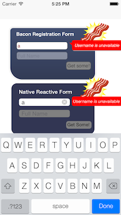

## Reactive Bridge between Objective-C views and JavaScript component logic

  

# JavaScript side

```javascript
        function bridgeStreams(bridge, component) {
            var registerBus = new Bacon.Bus();
            component.plug("register", registerBus);

            bridge.registerHandler('registerHandler', function(data, responseCallback) {
                registerBus.push(data);
                responseCallback('INVOKED REGISTER');
            });

            bridge.registerHandler('usernameHandler', function(data, responseCallback) {
                component.lenses['username'].set(data);
                responseCallback('GOT USERNAME ' + data);
            });

            bridge.registerHandler('fullnameHandler', function(data, responseCallback) {
                component.lenses['fullname'].set(data);
                responseCallback('GOT FULLNAME ' + data);
            });

            component.fullnameEnabled.onValue(function(val){
                bridge.callHandler("fullNameEnabled", val);
            });

            component.availabilityPending.onValue(function(val){
                bridge.callHandler("availabilityPending", val);
            });

            component.registrationPending.onValue(function(val){
                bridge.callHandler("registrationPending", val);
            });

            component.registerButtonEnabled.onValue(function(val){
                bridge.callHandler("registerButtonEnabled", val);
            });

            component.usernameAvailable.onValue(function(val){
                bridge.callHandler("unavailableLabelShowing", val);
            });


            component.registrationResponse(function (val) {
                bridge.callHandler("reset", val);
            });
        }

        $(function () {
            var component = createComponent();
            createView(component);
            connectWebViewJavascriptBridge(function(bridge){
                bridgeStreams(bridge, component);
            });
        })
```

# Objective-C side

```
        [userNameField.rac_textSignal subscribeNext:^(NSString * name) {
            [[self bridge] callHandler:@"usernameHandler" data:name];
        }];

        [fullNameField.rac_textSignal subscribeNext:^(NSString * name) {
            [[self bridge] callHandler:@"fullnameHandler" data:name];
        }];

        [[self bridge] registerHandler:@"fullNameEnabled" handler:^(id data, WVJBResponseCallback responseCallback) {
            BOOL b = [data boolValue];
            [fullNameField setEnabled:b];
            fullNameField.backgroundColor = b ? [UIColor whiteColor] : [UIColor grayColor];
        }];

        [[self bridge] registerHandler:@"registerButtonEnabled" handler:^(id data, WVJBResponseCallback responseCallback) {
            BOOL b = [data boolValue];
            [registerButton setEnabled:b];
            registerButton.backgroundColor = b ? [UIColor yellowColor] : [UIColor grayColor];
        }];

        [[self bridge] registerHandler:@"availabilityPending" handler:^(id data, WVJBResponseCallback responseCallback) {
            BOOL b = [data boolValue];
            b ? [activityIndicator startAnimating] : [activityIndicator stopAnimating];
        }];

        [[self bridge] registerHandler:@"unavailableLabelShowing" handler:^(id data, WVJBResponseCallback responseCallback) {
            BOOL b = [data boolValue];
            availabilityLabel.hidden = b;
        }];

        [[self bridge] registerHandler:@"registrationPending" handler:^(id data, WVJBResponseCallback responseCallback) {
            BOOL b = [data boolValue];
            b ? [registrationIndicator startAnimating] : [registrationIndicator stopAnimating];
        }];

```